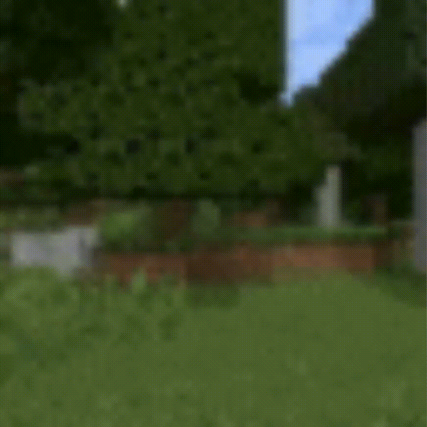
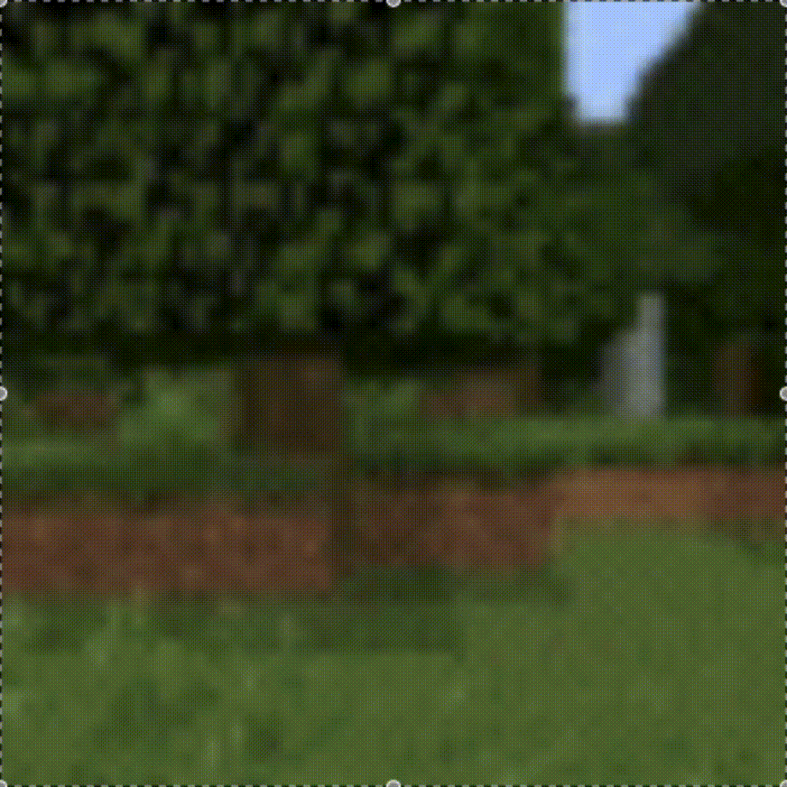
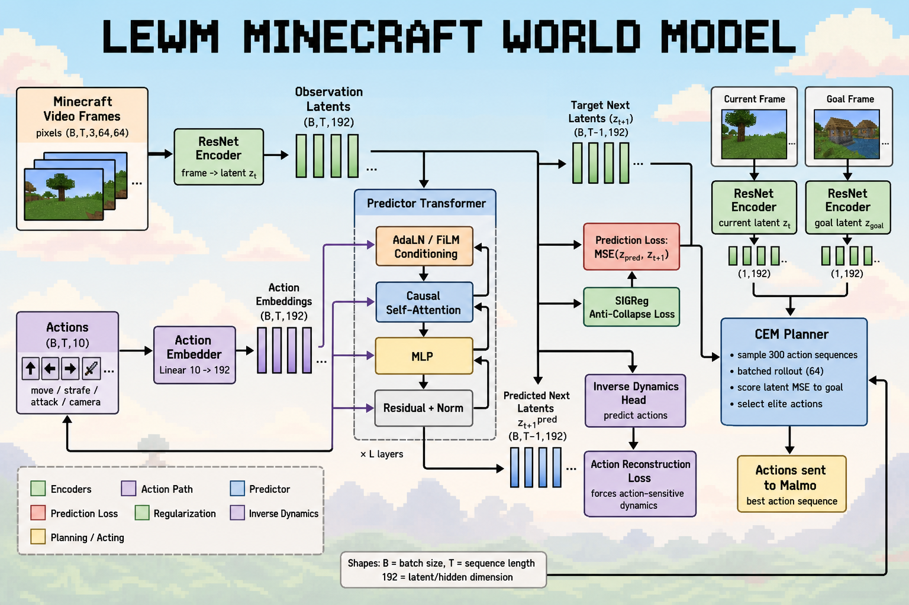
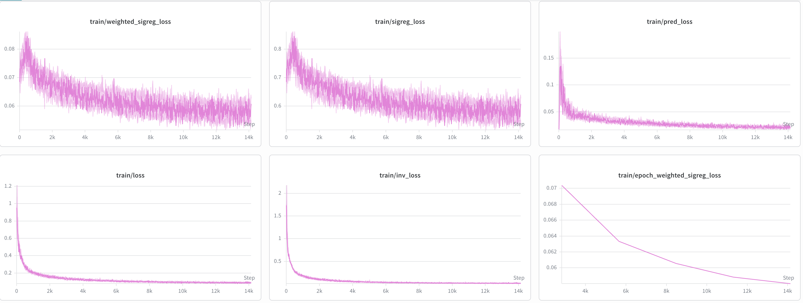
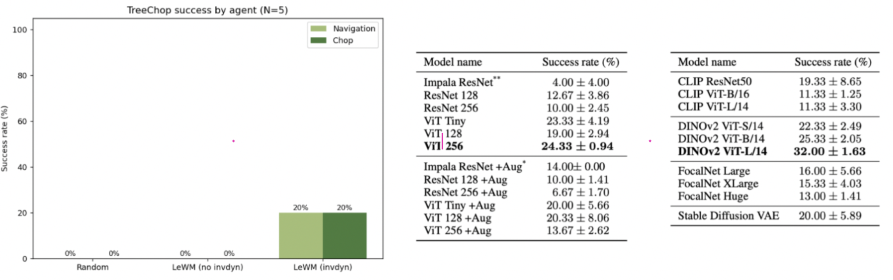
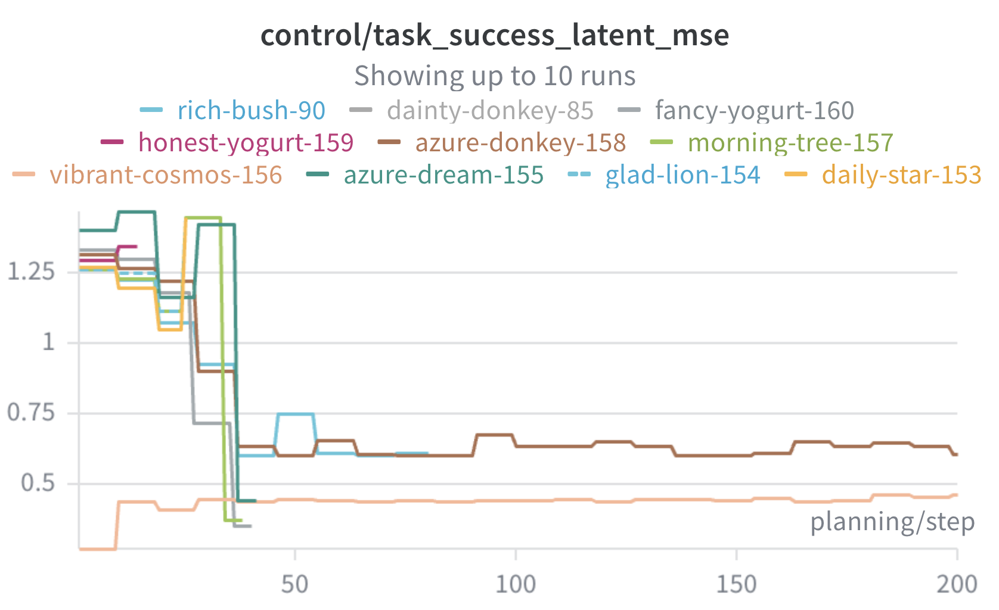
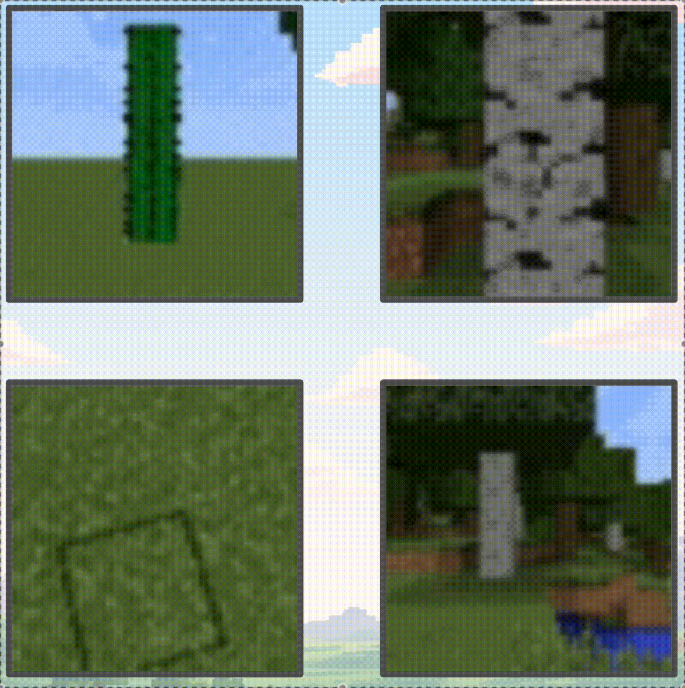
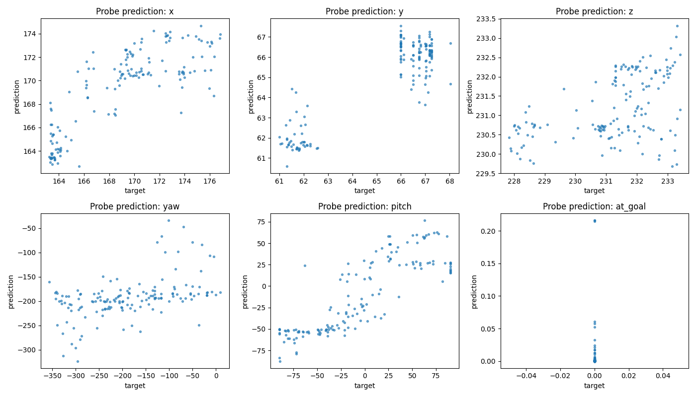

# LeWorldModel (LeWM) for Minecraft - Learning Minecraft dynamics in latent space without pixel reconstruction

Training Minecraft models demand massive scales: 29 million environment steps for pure reinforcement learning, 70,000 hours of gameplay video for imitation learning, or weeks of enterprise-grade cluster compute for generalist foundation agents.

We do not believe this is the frontier, and we wanted to test if an extraordinarily small model can replicate the performance of massive foundation models. Thus, we adapt LeWorldModel (LeWM), a recent lightweight model built on the JEPA architecture, to perform simple Minecraft tasks, beginning with tree-chopping.

<p align="center">
  
  &nbsp;
  
</p>

Minecraft by nature of its 3D design is more noisy than the primarily 2D tasks presented in the original paper. This introduces new challenges with grounding the model in Minecraft physics.

We adapt 3 new architectural components to the original LeWM to address this: (1) introducing inverse dynamics into the loss function (2) Unique goal image per stage triggered by MSE threshold and (3) 




- Training data: [https://zenodo.org/records/12659939](https://zenodo.org/records/12659939)
- Original paper: [https://arxiv.org/html/2603.19312v1](https://arxiv.org/html/2603.19312v1)

## Table of Contents

- [Introduction](#introduction)
- [Architecture](#architecture)
  - [Vision Transformer (Encoder)](#vision-transformer-encoder)
  - [Predictor](#predictor)
  - [Loss function](#loss-function)
- [Planning Rollout](#planning-rollout)
- [Training data](#training-data)
- [Results](#results)
  - [Linear Probing](#linear-probing)
- [Getting started](#getting-started)
  - [Project structure](#project-structure)
  - [Running Malmo](#running-malmo)
- [Current Art](#current-art)
  - [Reactive Imitation Models](#reactive-imitation-models)
  - [Generative Models](#generative-models)
  - [Self Supervised Models](#self-supervised-models)
- [Shape annotation key](#shape-annotation-key)
- [Additional Reading](#additional-reading)

---

## Introduction

Recently, [world models](https://arxiv.org/abs/1803.10122) have been deemed a state-of-the-art approach to generating interactive environments that evolve based on user actions. However, most of these approaches are generative (that is, they require the model to successfully reconstruct the next video sample and require a massive amount of training data to succeed). A recent approach to this data problem has been the [Joint-Prediction Embedding Architecture (JEPA)](https://arxiv.org/html/2603.19312v1) implemented as LeWorldModel, which does not reconstruct each frame and instead rolls out predictions entirely in imagination/latent space.

Our goal is to re-implement and adapt LeWM to perform simple tasks in Minecraft, a multivariate and egocentric 3D game that extends the LeWM’s primarily 2D and 3rd-person perspective benchmark tasks. We aim to develop a novel adaptation of LeWM to perform historically [expensive](https://www.findingtheta.com/blog/the-evolution-of-imagination-a-deep-dive-into-dreamerv3-and-its-conquest-of-minecraft) tasks in Minecraft and create a new benchmark for 3D, ego-centric tasks.

We begin with tree-chopping, where the bot will (i) Navigate to a destination goal frame of a tree and (ii) perform the “attack” action continuously until the tree trunk is successfully broken. This bot should not require access to any special data to function; instead, like a regular player, it should be able to observe, make predictions about the future, and plan actions to accomplish a task only using the visual information on the screen. 

---

## Architecture

LeWM is built on the latent joint-embedding predictive architecture (JEPA) trained from MineRL pixels and actions. At a high level:

1. **Encoder (Ti-ViT)** — compress each frame into a 192D embedding
2. **Predictor** — predict next observations in latent space conditioned on actions
3. **Planner (CEM)** — search & rollout action sequences in imagination (i.e. in LeWM) to reach a goal embedding

Training optimizes next-embedding prediction (how accurately did it predict the next embedding?) and SIGReg (how diverse and spread out are the predictions?). Planning reuses the frozen encoder and predictor at inference time.

#### Vision Transformer (Encoder)

First, we must teach the model how to create an appropriate internal representation of the environment. We borrow this idea from [human neurobiology](https://arxiv.org/html/2411.04383v1#S3): complex environments are simplified into abstract representations which we make predictions from. When we realize our predictions are wrong (i.e. by comparing against the actual future that occurred), we update our beliefs. Technically, we use a "latent embedding" to accomplish this.

The **Vision Transformer/Encoder** (Ti-ViT) transforms each RGB frame into a **192D** embedding independently. Each frame encodes semantic relationships across patches within the same frame using *spatial self-attention*. During training, the dataloader yields clips of **T=8** frames; with **B=128** clips per batch, the encoder processes **1024 frames** per forward pass.


|             |                                         |
| ----------- | --------------------------------------- |
| **Input**   | `(B·T, 3, 64, 64)` RGB                  |
| **Patches** | 64 per frame (8×8 grid)                 |
| **Depth**   | **12** blocks, **3** heads, MLP **768** |
| **Output**  | `(B·T, 192)` CLS embedding per frame    |


> **We use a post-trained Resnet model for the final results of this experiment. However, we have obesrved that ViT and Resnet achieve similar results.**

### Predictor

The predictor uses causal self-attention to attend to the past 8 timestamps of observation embeddings. 

Uniquely, it uses Adaptive Layer Normalization (AdaLN) to transform each of these 8 embeddings to condition on the *action* taken at that timestamp. 

We observed that due to the noise of the 3D environment, AdaLN can misinterpret an action’s impact on the environment (as it only operated on . To mitigate this, we enforced a stronger causal link between actions and state changes through an **inverse dynamics model**. This is integrated into the loss function and ensures that actions are retrievable from the latent embeddings.

The output of the predictor is the *predicted next observation embedding* rather than actions.


|             |                                                                                 |
| ----------- | ------------------------------------------------------------------------------- |
| **Depth**   | **6** transformer blocks, **16** attention heads, dropout **0.10**              |
| **History** | `history_len=8` (matches clip length)                                           |
| **Input**   | `emb[:, :-1]` (most recent frame) and `action_emb[:, :-1]` (most recent action) |
| **Output**  | **7** predicted next embeddings                                                 |


For a clip of 8 frames, the model asks seven “what comes next?” questions: given `(z_0, a_0)…(z_6, a_6)`, predict `z_1…z_7`.

### Loss function

The **Loss function** combines Prediction loss (MSE between predicted and target next embeddings) and SIGReg loss (forces embeddings toward an isotropic Gaussian; see below).

As mentioned, we incorporate Inverse dynamics into the loss:

$$ L_{\text{LeWM}} \triangleq L_{\text{pred}} + \lambda  \text{SIGReg}(Z) $$

**SigReg** addresses representation collapse: when embeddings oversimplify observations so next-step prediction becomes trivially easy.

There is more detailed explanation on implementation in the paper.



---

## Planning Rollout

The **Planner** imagines action sequences that optimize its chance of reaching the objective -- entirely in latent imagination. The encoder turns the start frame and a goal frame (e.g. a view of the tree) into 192D embeddings, then rolls candidate action trajectories thru the predictor.

At each iteration, Cross-Entropy Method is used to sample **300** candidate sequences of length **H**, rolls each out in imagination, scores the final predicted embedding against **z_g**, and refits the sampling distribution from the top **30** elites. The planner returns **μ** (the mean of the final elite set).


|            |                                                         |
| ---------- | ------------------------------------------------------- |
| **Input**  | `o_1`, `o_g` — `(1, 3, 64, 64)`                         |
| **Output** | `(H=8, A=10)` mean action plan **μ**                    |
| **Cost**   | MSE(final imagined **ẑ**, **z_g**)                      |
| **Solver** | CEM — **300** samples, **30** elites, **10** iterations |


---

## Training data

We use the MineRL dataset for training. The initial dataset looks like this: `data/MineRLTreechop-v0/<trajectory>/` with subfiles `recording.mp4`, `rendered.npz`, `metadata.json`.

After pre-processing, the consolidated HDF5 lives at `data/mineRL_training.h5`. Per-trajectory `actions.npy` files are written under `data/MineRLTreechop-v0/<trajectory>/`.

- **Size**: 210 trajectories, 453,496 total timesteps.
- **Video frame dimensions**: 64 x 64 RGB
- **Frame clips**: (B=128, T=8, C=3, H=64, W=64)
  - Each clip is 8 RGB frames from a video sample. Each batch consists of 128 clips
- **Actions**: (B, T, 10)

Each cleaned action row is `(10,)`, columns:

```
[ forward, left, back, right, jump, sneak, sprint, attack, pitch, yaw ]
```

Indices **0–7** are binary `{0, 1}`. Indices **8–9** are camera deltas in degrees (z-normalized at load time). Example — moving forward and left at timestep 0:

```
timestamp 0 = [1, 1, 0, 0, 0, 0, 0, 0, <pitch>, <yaw>]
```

---

## Results

**TreeChop success rate**

> This is a test run given a small planner rollout sample size.

### Baselines
Results here are referenced from this [paper](https://openreview.net/pdf?id=6CetUU9FSt). After 5 test runs, we observe that the agent can successfully breaks the block 20% of the time. This is higher than the majority of approaches. We also observed that the average planning time was 3.3s on our 3D tasks. This is higher than the 0.91s average from the original paper; however, it is still 14.5x faster in speed compared to other models.

| Model                       | Success (%)  |
| --------------------------- | ------------ |
| Impala ResNet (reactive BC) | 4.00 ± 4.00  |
| ViT-256 (reactive BC)       | 24.33 ± 0.94 |
| Stable Diffusion VAE + BC   | 20.00 ± 5.89 |
| DINOv2 ViT-L/14 + BC        | 32.00 ± 1.63 |
| **LeWMMinecraft (ours)**    | 20.0         |


Random action and the baseline LeWM without the indy model completely fail.


### Control/Rollout performance
MSE steadily decreases over time and drops around 30-40 timestamps.


The model struggles with:
1. out-of-distribution objects that it wasn't trained on. 
2. tasks that require a combination of multiple actions (ex: jumping, sneaking, etc.). 
3. without the inverse dynamics model, its observations collapse and it spins around in the environment



### Linear Probing
We trained a regression probe to retrieve a list of target physical properties of the Malmo environment (X, Y, Z, Yaw, Pitch) from the encoded latents. The model most successfully retrieved X and Y position (Forward/Backwards and Up/Down, respectively) and pitch (Up/Down orientation). However, the model struggles to retrieve Z (Left/Right movement) and yaw (Left/Right). This mirrors the performance of the model in Malmo, which achieves the tree-chopping task when left/right and strafe actions are disabled but hallucinates and moves off target when yaw and z actions are enabled.



---

## Getting started

1. Add API Keys to .env file
2. Install PyTorch for your platform ([pytorch.org](https://pytorch.org)), then install this repo:

```
python -m pip install -e .
```

1. Download dataset into your local repo
2. Run `notebooks/01_data_processing.ipynb` in full. This loads the processed data into the `data/` folder. This is necessary for training
3. Begin training

```
python scripts/train.py
```

Trained model checkpoints will be stored in `artifacts/checkpoints/`.

1. Run tests

```
python -m pytest
```

Note: `test_planner.py` requires `artifacts/checkpoints/best_model.pt` to exist.

### Project structure

```
le-wm-minecraft/
├── src/lewm/              # installable Python package
│   ├── models/            # LeWM, ViT encoder, predictor, action embedder
│   ├── planning/          # CEM planner
│   ├── data/              # dataset normalization helpers
│   └── paths.py           # repo-root path helper
├── scripts/               # train.py, run_lewm_client.py
├── notebooks/             # data prep and debugging notebooks
├── config/lewm.yaml       # hyperparameters and artifact paths
├── data/                  # raw MineRL data + mineRL_training.h5
├── artifacts/
│   ├── checkpoints/       # best_model.pt, epoch_*.pt
│   └── fixtures/          # goal_tree_nav.pkl, goal_tree_chop.pkl, video_frames.pkl
└── Malmo/LeWM_Files/      # Malmo server integration (Python 3.5)
```

### Running Malmo

**The following is for Mac users.** We recommend the [Malmo container](https://hub.docker.com/layers/andkram/malmo_build_headless_0_35_6/latest/images/sha256-cb22e8a1d5aed24e8f169b7f8c95d0d10e2e84010694edb05c05f2cce35000ba) (note: this image is quite old). After pulling the image:

**1. Start the container** (from repo root; bind-mount this repo into the container):

```bash
docker run -d \
  --platform linux/amd64 \
  -p 25565:25565 \
  -v <path_to>/le-wm-minecraft:/home/malmo/le-wm-minecraft \
  --name malmo \
  andkram/malmo:latest
```

**2. Inside the container** — start the Malmo mission runner (Python 3.5 + `Malmo/py27/` integration layer):

```bash
docker exec -it malmo bash
cd /home/malmo/le-wm-minecraft
python3.5 Malmo/py27/malmo_mission_runner_py27.py
```

Wait for:

```text
Mission running — starting LeWM socket on 0.0.0.0:25565
Listening for connection...
```

**3. On your Mac** (repo root, same venv as training) — run the LeWM client:

```bash
python scripts/run_lewm_client.py
```


| Where     | Command                                             | Role                   |
| --------- | --------------------------------------------------- | ---------------------- |
| Container | `python3.5 Malmo/py27/malmo_mission_runner_py27.py` | server, port **25565** |
| Client    | `python scripts/run_lewm_client.py`                 | CEM planner → `mu[0]`  |


---

## Current Art

We situate **Le-WM-Minecraft** against three families of visuomotor Minecraft agents


| Model                    | Image   | Params | Dim  |
| ------------------------ | ------- | ------ | ---- |
| Impala ResNet            | 64×64   | —      | 7200 |
| ViT-256                  | 256×256 | 8.9M   | 512  |
| Stable Diffusion 2.1 VAE | 256×256 | 34M    | 4096 |
| DINOv2 ViT-L/14          | 224×224 | 300M   | 1024 |
| LeWM (original)          | 64×64   | 15.0M  | 192  |
| **LeWMMinecraft (ours)** | 64×64   | 15.0M  | 192  |


### Reactive Imitation Models

**OpenAI Video Pretraining** — Imitation learning on a massive video corpus, grounded with an inverse dynamics model. It does not condition on latents to predict the future; instead it uses a traditional reward-based RL policy that is expensive and dependent on human steering.

**Reinforcement Learning (MineRL)** — Behavioral cloning from expert demonstrations. Effective for basic primitives, but struggles with long-horizon tasks and sample efficiency without explicit rewards or human guidance.

### Generative Models

Unlike LeWM, these reconstruct in pixel space and spend capacity on spatial detail.

**DreamerV3** — Recurrent latent world model via pixel reconstruction; first to collect diamonds from scratch in Minecraft, but high training wall-clock time from decoder overhead.

**Genie** — Spatiotemporal transformer on unlabeled video; generates controllable future frames from latent actions, but inference latency limits real-time planning.

**Stable Diffusion VAE** — Compresses images to a low-dimensional latent space with strong texture fidelity; autoregressive rollouts suffer compounding artifacts and frame hallucination over long horizons.

### Self Supervised Models

**DINO-WM** — Frozen DINOv2 features plus a world model over transition dynamics. Planning fails when the encoder misses task-critical spatial coordinates (lateral orientation, 3D obstacle geometry).

LeWM belongs to the **self-supervised, joint-embedding predictive** family (I-JEPA, V-JEPA, DINO-WM): it predicts *future embeddings* in latent space rather than reconstructing pixels. **DINOv2** is the strongest TreeChop BC backbone (32%), motivating a self-supervised representation paired with a latent world model and planner — the LeWM approach we adapt here.

---

## Shape annotation key


| Symbol   | Meaning                  |
| -------- | ------------------------ |
| **B**    | batch size (**128**)     |
| **T**    | clip length (**8**)      |
| **H**    | planning horizon (**8**) |
| **C**    | channels (**3**)         |
| **H, W** | image size (**64**)      |
| **D**    | embedding dim (**192**)  |
| **A**    | action dim (**10**)      |


---

## Additional Reading

- [Neural Architectures for Vision > Transformers (MIT)](https://visionbook.mit.edu/transformers.html)
- [CLS Token in Vision Transformers](https://www.abhik.ai/concepts/attention/cls-token)

