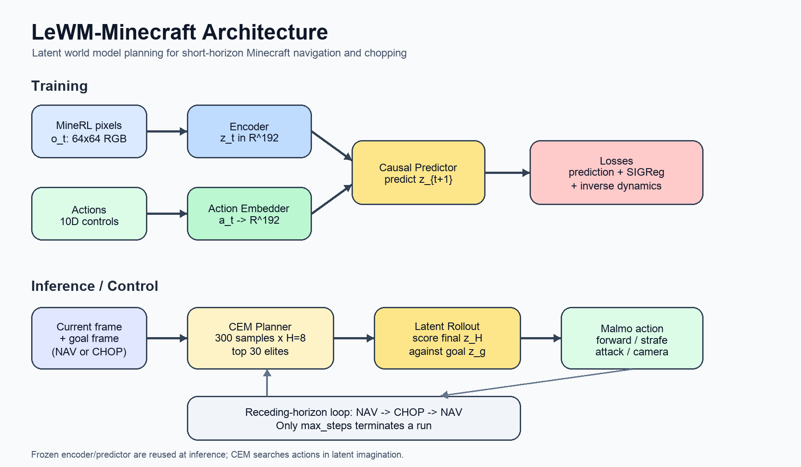

# LeWorldModel (LeWM) for Minecraft

We adapt LeWorldModel (LeWM) to perform simple Minecraft tasks, beginning with tree-chopping, using the Malmo sandbox environment.

Minecraft by nature of its 3D design is more noisy than the primarily 2D and 3rd person POV tasks presented in the paper. This introduces new challenges with grounding the model in Minecraft physics.



Training data: [https://zenodo.org/records/12659939](https://zenodo.org/records/12659939)

Original paper: [https://arxiv.org/html/2603.19312v1](https://arxiv.org/html/2603.19312v1)

## Table of Contents

- [Getting started](#getting-started)
- [Project structure](#project-structure)
- [Architecture](#architecture)
  - [Le World Model](#le-world-model)
  - [Action Embedder](#action-embedder)
  - [SIGReg](#sigreg)
  - [Planning Rollout](#planning-rollout)
- [Training data](#training-data)
- [Shape annotation key](#shape-annotation-key)
- [Additional Reading](#additional-reading)

## Getting started

1. Add API Keys to .env file
2. Install PyTorch for your platform ([pytorch.org](https://pytorch.org)), then install this repo:

```
python -m pip install -e .
```

1. Download dataset into your local repo
2. Run `notebooks/01_data_processing.ipynb` in full. This loads the processed data into the `data/` folder. This is necessary for training
3. Begin training

```
python scripts/train.py
```

Trained model checkpoints will be stored in `artifacts/checkpoints/`.

1. Run tests

```
python -m pytest
```

Note: `test_planner.py` requires `artifacts/checkpoints/best_model.pt` to exist.

### Project structure

```
le-wm-minecraft/
├── src/lewm/              # installable Python package
│   ├── models/            # LeWM, ViT encoder, predictor, action embedder
│   ├── planning/          # CEM planner
│   ├── data/              # dataset normalization helpers
│   └── paths.py           # repo-root path helper
├── scripts/               # train.py, run_lewm_client.py
├── notebooks/             # data prep and debugging notebooks
├── config/lewm.yaml       # hyperparameters and artifact paths
├── data/                  # raw MineRL data + mineRL_training.h5
├── artifacts/
│   ├── checkpoints/       # best_model.pt, epoch_*.pt
│   └── fixtures/          # goal_tree_nav.pkl, goal_tree_chop.pkl, video_frames.pkl
└── Malmo/LeWM_Files/      # Malmo server integration (Python 3.5)
```

### Running Malmo

**The following is for Mac users.** We recommend the [Malmo container](https://hub.docker.com/layers/andkram/malmo_build_headless_0_35_6/latest/images/sha256-cb22e8a1d5aed24e8f169b7f8c95d0d10e2e84010694edb05c05f2cce35000ba) (note: this image is quite old). After pulling the image:

**1. Start the container** (from repo root; bind-mount this repo into the container):

```bash
docker run -d \
  --platform linux/amd64 \
  -p 25565:25565 \
  -v <path_to>/le-wm-minecraft:/home/malmo/le-wm-minecraft \
  --name malmo \
  andkram/malmo:latest
```

**2. Inside the container** — start the Malmo mission runner (Python 3.5 + `Malmo/py27/` integration layer):

```bash
docker exec -it malmo bash
cd /home/malmo/le-wm-minecraft
python3.5 Malmo/py27/malmo_mission_runner_py27.py
```

Wait for:

```text
Mission running — starting LeWM socket on 0.0.0.0:25565
Listening for connection...
```

**3. On your Mac** (repo root, same venv as training) — run the LeWM client:

```bash
python scripts/run_lewm_client.py
```


| Where     | Command                                             | Role                                                            |
| --------- | --------------------------------------------------- | --------------------------------------------------------------- |
| Container | `python3.5 Malmo/py27/malmo_mission_runner_py27.py` | Malmo server — sends frames, receives actions on port **25565** |
| Client    | `python scripts/run_lewm_client.py`                 | LeWM client — plans with CEM, sends `mu[0]` back                |


## Current Art

TBD

## LeWorldModel Architecture

LeWM is built on the latent joint-embedding predictive architecture (JEPA) trained from MineRL pixels and actions. At a high level:

1. **Encoder (Ti-ViT)** — compress each frame into a 192D embedding
2. **Predictor** — predict next observations in latent space conditioned on actions
3. **Planner (CEM)** — search & rollout action sequences in imagination (i.e. in LeWM) to reach a goal embedding

Training optimizes next-embedding prediction (how accurately did it predict the next embedding?) and SIGReg (how diverse and spread out are the predictions?). Planning reuses the frozen encoder and predictor at inference time.

#### Vision Transformer (Encoder)

First, we must teach the model how to create an appropriate internal representation of the environment. We borrow this idea from [human neurobiology](https://arxiv.org/html/2411.04383v1#S3): complex environments are simplified into abstract representations which we make predictions from. When we realize our predictions are wrong (i.e. by comparing against the actual future that occurred), we update our beliefs. Technically, we use a "latent embedding" to accomplish this.

The **Vision Transformer/Encoder** (Ti-ViT) transforms each RGB frame into a **192D** embedding independently. Each frame encodes semantic relationships across patches within the same frame using *spatial self-attention*. During training, the dataloader yields clips of **T=8** frames; with **B=128** clips per batch, the encoder processes **1024 frames** per forward pass.


|                  |                                                                                                                 |
| ---------------- | --------------------------------------------------------------------------------------------------------------- |
| **Input (o_t)**  | `(B·T, C=3, H=64, W=64)` — 64×64 RGB                                                                            |
| **Patch embed**  | **64 patches** per frame `(8×8 patches)`                                                                        |
| **ViT depth**    | **12** transformer blocks, **3** attention heads, MLP hidden **768** (`4×192`)                                  |
| **Output (z_t)** | `(B·T, D=192)` — one CLS-token embedding per frame after a projection head (Linear → BatchNorm → GELU → Linear) |


### Predictor

The embeddings are forwarded to the **Predictor**, implemented as a 6-layer causal transformer which takes the 192D embedding of the observation and a 192D embedding of actions as input. It uses causal self-attention to attend to the past 8 timestamps of observation embeddings. Uniquely, it uses Adaptive Layer Normalization (AdaLN) to transform each of these 8 embeddings to condition on the *action* taken at that timestamp. The output of the predictor is the *predicted next observation embedding* rather than actions.


|                     |                                                                                                                |
| ------------------- | -------------------------------------------------------------------------------------------------------------- |
| **Depth**           | **6** transformer blocks, **16** attention heads, dropout **0.10**                                             |
| **Conditioning**    | AdaLN — each block scales/shifts normalized observation tokens using the action embedding at the same timestep |
| **Attention**       | Causal self-attention over the observation sequence (no peeking at future latent states)                       |
| **History**         | `history_len=8` — matches the training clip length                                                             |
| **Training input**  | `emb[:, :-1]` and `action_emb[:, :-1]` → **7** timesteps from an **8**-frame clip                              |
| **Training output** | **7** predicted next embeddings, supervised against `emb[:, 1:]` (actual next frames)                          |


For a clip of 8 frames, the model asks seven “what comes next?” questions: given `(z_0, a_0)…(z_6, a_6)`, predict `z_1…z_7`.

### Loss function

The **Loss function** combines Prediction loss (MSE between predicted and target next embeddings) and SIGReg loss (forces embeddings toward an isotropic Gaussian; see below).

$$
L_{\text{LeWM}} \triangleq L_{\text{pred}} + \lambda  \text{SIGReg}(Z)
$$

**SigReg** addresses representation collapse: when embeddings oversimplify observations so next-step prediction becomes trivially easy.

There is more detailed explanation on implementation in the paper.

## Planning Rollout

The **Planner** imagines action sequences that optimize its chance of reaching the objective -- entirely in latent imagination. The encoder turns the start frame and a goal frame (e.g. a view of the tree) into 192D embeddings, then rolls candidate action trajectories thru the predictor.

At each iteration, Cross-Entropy Method is used to sample **300** candidate sequences of length **H**, rolls each out in imagination, scores the final predicted embedding against **z_g**, and refits the sampling distribution from the top **30** elites. The planner returns **μ** (the mean of the final elite set).


|                          |                                                                          |
| ------------------------ | ------------------------------------------------------------------------ |
| **Input (o_1)**          | `(1, 3, 64, 64)` — current observation (RGB, `[0, 1]`)                   |
| **Input (o_g)**          | `(1, 3, 64, 64)` — goal observation                                      |
| **Output**               | `(H, A=10)` — mean action plan **μ** from CEM                            |
| **Cost**                 | MSE between final imagined embedding **ẑ_H** and **z_g** = encoder(o_g)  |
| **Solver**               | Cross-Entropy Method — refit `(μ, σ)` from elite rollouts each iteration |
| **n_samples**            | **300** candidate trajectories per CEM iteration                         |
| **n_elites**             | **30** lowest-cost trajectories kept per iteration                       |
| **max_iter**             | **10** CEM iterations                                                    |
| **planning_horizon (H)** | **8** imagined steps per candidate                                       |
| **action_dim (A)**       | **10** (8 movement buttons + 2 camera)                                   |


## Training data

We use the MineRL dataset for training. The initial dataset looks like this: `data/MineRLTreechop-v0/<trajectory>/` with subfiles `recording.mp4`, `rendered.npz`, `metadata.json`.

After pre-processing, the consolidated HDF5 lives at `data/mineRL_training.h5`. Per-trajectory `actions.npy` files are written under `data/MineRLTreechop-v0/<trajectory>/`.

- **Size**: 210 trajectories, 453,496 total timesteps.
- **Video frame dimensions**: 64 x 64 RGB
- **Frame clips**: (B=128, T=8, C=3, H=64, W=64)
  - Each clip is 8 RGB frames from a video sample. Each batch consists of 128 clips
- **Actions**: (B, T, 10)

Each cleaned action row is `(10,)`, columns:

```
[ forward, left, back, right, jump, sneak, sprint, attack, pitch, yaw ]
```

Indices **0–7** are binary `{0, 1}`. Indices **8–9** are camera deltas in degrees (z-normalized at load time). Example — moving forward and left at timestep 0:

```
timestamp 0 = [1, 1, 0, 0, 0, 0, 0, 0, <pitch>, <yaw>]
```

## Performance

## Shape annotation key


| Symbol   | Meaning                          |
| -------- | -------------------------------- |
| **B**    | batch size (128 during training) |
| **T**    | clip length (8 frames / actions) |
| **H**    | planning horizon (8 by default)  |
| **C**    | image channels (3)               |
| **H, W** | image height / width (64)        |
| **D**    | latent embedding dim (192)       |
| **A**    | action dim (10)                  |


## Additional Reading

- [Neural Architectures for Vision > Transformers (MIT)](https://visionbook.mit.edu/transformers.html)
- [CLS Token in Vision Transformers](https://www.abhik.ai/concepts/attention/cls-token)

